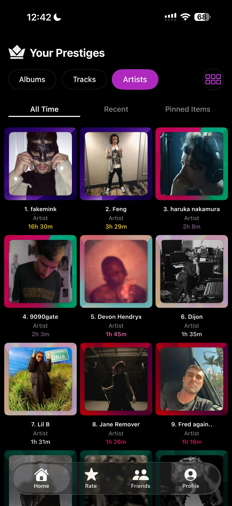
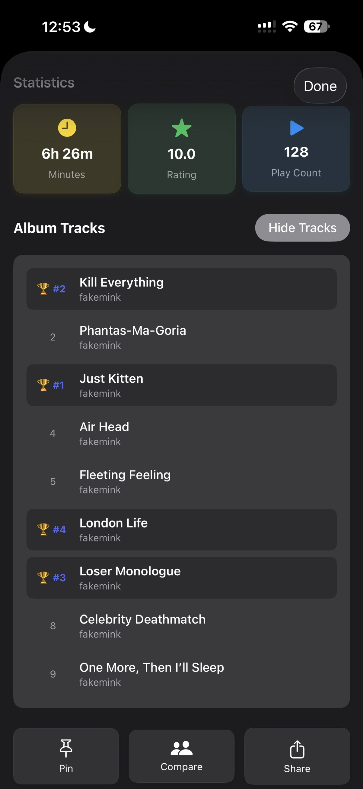
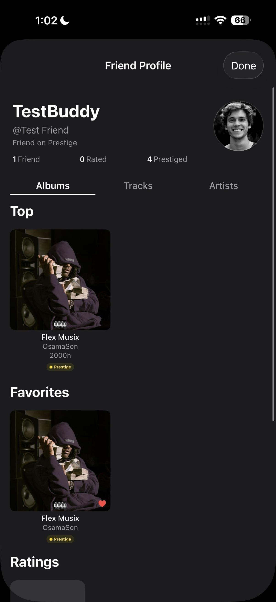

# PrestigeNative - iOS Music Fandom Experience 🎵

*Transform your Spotify listening habits into a competitive, achievement-based social experience on iOS*

[](https://swift.org/)
[](https://developer.apple.com/ios/)
[](https://developer.apple.com/xcode/swiftui/)
[](https://developer.apple.com/xcode/)

## 🎯 What is Prestige?

Prestige redefines how we experience, share, and connect over music on iOS. At its core, Prestige assigns levels of "prestige" based on the time you spend with your favorite albums, songs, and artists. Think of it as gamifying your music listening - compete with friends, rate your music, share your unique music journey, and use your listening habits as the ultimate conversation starter.

## 🌟 Key Features

### 🏆 **Prestige System**
- **7-Tier Achievement System**: Bronze → Silver → Gold → Platinum → Diamond → Iridium → Dark Matter
- **Time-Based Progression**: Unlock higher tiers by demonstrating dedication to your favorite music
- **Visual Badges**: Beautiful prestige indicators that showcase your musical commitment
- **Native iOS Animations**: Smooth, fluid transitions optimized for iPhone and iPad

### 🤝 **Social Features**
- **Compare Prestiges**: See how your dedication stacks up against friends
- **Friend Profiles**: Discover friends' music tastes and gain insights into their personalities
- **Social Discovery**: Find new music through your network's listening habits
- **Live Activity**: Real-time updates of what friends are currently playing

### 🎧 **Spotify Integration**
- **Seamless Authentication**: Native iOS Spotify SDK integration
- **Real-time Sync**: Live data updates from your Spotify account
- **Complete History**: Tracks your listening beyond Spotify's limited native history
- **Background Refresh**: Automatic updates even when the app is closed

### 🎮 **Gamification**
- **Achievement System**: Unlock cosmetic badges for listening milestones
- **Leaderboards**: Compete with friends on favorite tracks, albums, and artists
- **Progress Tracking**: Visual progress bars showing your journey to the next tier
- **Push Notifications**: Get notified when you achieve new prestige levels

### 📱 **iOS Native Features**
- **Widget Support**: Home screen widgets to display your top prestiges
- **SharePlay Integration**: Listen together with friends in FaceTime
- **Focus Mode Support**: Customize app behavior based on your Focus settings
- **Apple Music Fallback**: Support for users who prefer Apple Music over Spotify

## 🧠 Philosophical Foundation

> *Inspired by Abraham Maslow's Peak Experiences*

Abraham Maslow identified music as a universal pathway to peak human experiences – moments of joy, connection, and self-realization. Prestige builds on this idea, creating a space where music is not just listened to but celebrated and shared.

## 🎶 Why Prestige Matters

In 2025, music has become a lifestyle for millions globally. Despite the explosion of streaming platforms and fandoms, there's no single community where music lovers can come together and dive deep into the magic of music. Prestige fills this gap by fostering connection through:

- **Authentic Expression**: Share your music taste, not just photos
- **Friendly Competition**: Prove your dedication to fellow music fans
- **Musical Discovery**: Learn about others through their unique preferences
- **Meaningful Connections**: Connect over shared musical experiences
- **Native Performance**: Lightning-fast experience optimized for iOS

## 🛠️ Technology Stack

### **Core Technologies**
- **Swift 5.9** - Modern, safe, and fast programming language
- **SwiftUI** - Declarative UI framework for building native iOS interfaces
- **Combine** - Reactive programming framework for handling asynchronous events
- **Core Data** - Persistent storage for offline functionality
- **CloudKit** - Seamless sync across all your Apple devices

### **Networking & APIs**
- **URLSession** - Native networking with async/await support
- **Spotify iOS SDK** - Official SDK for Spotify integration
- **WebSocket** - Real-time updates for live friend activity

### **UI/UX**
- **SF Symbols** - Apple's comprehensive icon library
- **UIKit Integration** - Legacy support where needed
- **Dynamic Type** - Full accessibility support
- **Dark Mode** - Automatic theme switching

### **Testing & Quality**
- **XCTest** - Comprehensive unit and UI testing
- **TestFlight** - Beta testing distribution
- **Instruments** - Performance profiling and optimization

## 🚀 Getting Started

### Prerequisites
- **macOS Sonoma 14.0+** - Required for latest Xcode
- **Xcode 15.0+** - Latest development tools
- **iOS 17.0+** - Deployment target
- **Spotify Premium Account** - For full feature access
- **Apple Developer Account** - For device testing

### Installation

1. **Clone the repository**
   ```bash
   git clone https://github.com/yourusername/PrestigeNative.git
   cd PrestigeNative
   ```

2. **Open in Xcode**
   ```bash
   open PrestigeNative.xcodeproj
   ```

3. **Configure Spotify SDK**
   - Add your Spotify App Client ID to `Info.plist`
   - Configure OAuth redirect URI
   - Update bundle identifier

4. **Build and Run**
   - Select your target device or simulator
   - Press `Cmd + R` to build and run
   - Sign in with your Spotify account

## 📱 Usage

### **Getting Started**
1. **Sign in with Spotify** - Authenticate using native Spotify SDK
2. **Grant Permissions** - Allow access to music activity and notifications
3. **Profile Setup** - Set your nickname and select favorite items
4. **Start Listening** - Your Spotify listening automatically syncs
5. **Add Friends** - Search and connect with other Prestige users
6. **Explore** - Discover music through your social network

### **Key Screens**
- **Dashboard** - View your top tracks, albums, and artists with prestige levels
- **Profile** - Customize your profile and view detailed statistics
- **Friends** - Manage connections and browse their music tastes
- **Individual Items** - Deep dive into specific tracks, albums, or artists
- **Ratings** - Rate and review your favorite music

## 🎨 Screenshots

### 🚀 Getting Started
<div align="center">
  
  <p><em>Native iOS authentication with Spotify integration</em></p>
</div>

### 🏠 Home Dashboard
<div align="center">
  <table>
    <tr>
      <td align="center">
        
        <p><em>Track your favorite songs with prestige levels</em></p>
      </td>
      <td align="center">
        
        <p><em>Browse your top albums with visual prestige badges</em></p>
      </td>
    </tr>
    <tr>
      <td align="center" colspan="2">
        
        <p><em>Discover your most listened artists and their prestige tiers</em></p>
      </td>
    </tr>
  </table>
</div>

### 👤 Profile & Individual Views
<div align="center">
  <table>
    <tr>
      <td align="center">
        
        <p><em>Your personalized music profile showcasing top items</em></p>
      </td>
      <td align="center">
        
        <p><em>Deep dive into specific tracks with detailed statistics</em></p>
      </td>
    </tr>
  </table>
</div>

### ⭐ Rating System
<div align="center">
  <table>
    <tr>
      <td align="center">
        
        <p><em>Rate your favorite music on a personal scale</em></p>
      </td>
      <td align="center">
        
        <p><em>View your ratings alongside prestige achievements</em></p>
      </td>
    </tr>
    <tr>
      <td align="center">
        
        <p><em>Browse all your rated albums in one place</em></p>
      </td>
      <td align="center">
        
        <p><em>View your complete artist rating collection</em></p>
      </td>
    </tr>
    <tr>
      <td align="center" colspan="2">
        
        <p><em>Compare your music taste and ratings with friends</em></p>
      </td>
    </tr>
  </table>
</div>

### 🤝 Social Features
<div align="center">
  <table>
    <tr>
      <td align="center">
        
        <p><em>Explore your friends' music profiles and prestige levels</em></p>
      </td>
      <td align="center">
        
        <p><em>Discover shared musical interests and friendly competition</em></p>
      </td>
    </tr>
  </table>
</div>

## 🤝 Contributing

We welcome contributions! Please see our [Contributing Guidelines](CONTRIBUTING.md) for details.

### **Development Workflow**
1. Fork the repository
2. Create a feature branch (`git checkout -b feature/amazing-feature`)
3. Make your changes in Xcode
4. Run tests (`Cmd + U`)
5. Commit your changes (`git commit -m 'Add amazing feature'`)
6. Push to the branch (`git push origin feature/amazing-feature`)
7. Open a Pull Request

### **Code Style**
- Follow Swift API Design Guidelines
- Use SwiftLint for code formatting
- Write unit tests for new features
- Update documentation as needed

## 📊 Project Structure

```
PrestigeNative/
├── PrestigeNative/
│   ├── Core/           # Core business logic and models
│   ├── Features/       # Feature modules (Home, Profile, etc.)
│   ├── Services/       # API and data services
│   ├── Shared/         # Shared components and utilities
│   └── Resources/      # Assets, fonts, and configurations
├── PrestigeNativeTests/
└── PrestigeNativeUITests/
```

## 🔒 Privacy & Security

- **Data Privacy**: We respect user privacy and only collect necessary music listening data
- **Secure Authentication**: OAuth 2.0 with PKCE for secure Spotify authentication
- **Local Storage**: Sensitive data encrypted using iOS Keychain
- **Network Security**: All API communications over HTTPS with certificate pinning

## 📈 Performance

- **60 FPS Scrolling**: Optimized list rendering for smooth performance
- **Lazy Loading**: Images and data loaded on-demand
- **Background Processing**: Heavy operations offloaded to background queues
- **Memory Management**: Automatic reference counting with careful retain cycle prevention

## 🙏 Acknowledgments

- **Abraham Maslow** - For the philosophical foundation of peak experiences through music
- **Spotify** - For providing the incredible iOS SDK and Web API
- **Apple Developer Community** - For excellent documentation and support
- **The Music Community** - For inspiring us to create a platform that celebrates musical passion
- **Open Source Contributors** - For the amazing libraries that make this possible

## 📚 Citations

Abraham Maslow, "Music, Education, and Peak Experiences," in *Documentary Report of the Tanglewood Symposium*, ed. Robert Choate (Washington, DC: Music Educators National Conference, 1968).

## 📄 License

Copyright © 2025 Prestige. All rights reserved.

---

**Built for Music Lovers, By Music Lovers** 🎧

*Your music is more than background noise—it's your story, told in melodies and rhythms. Prestige for iOS brings a native, performant, and beautiful experience where you're not defined by photos or followers, but by the beats that resonate with your soul.*

**Let's make music more social, more meaningful, and more connected.**